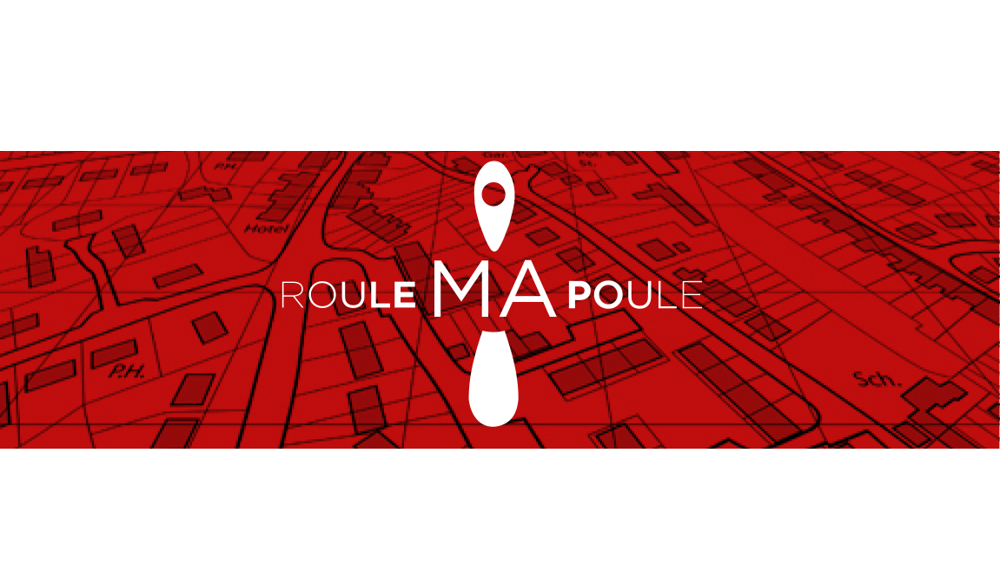
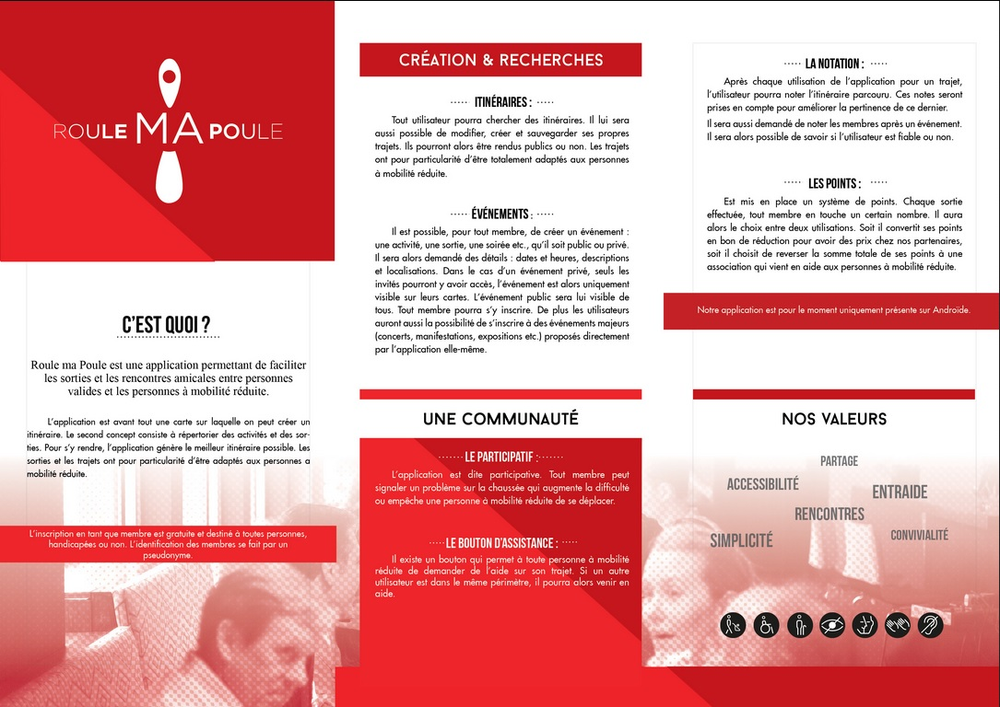

*Sujet : Cartographier la ville*

## Table

- [Le Projet](#le-projet)
- [Technologies utilisées](#technologies-utilisees)
- [Fonctionalités](#fonctionalites)
- [Repartition des tâches](#repartition-des-taches)
- [Mock-up](#mockup)

## Le Projet

Qu' est ce que c'est ?   
 Roule ma poule est une application permettant de faciliter les sorties et les rencontres amicales entre personnes valides et les personnes à mobilité reduite.  
 L'application est en premier lieu une carte sur laquelle on peut créer un itineraire adapté aux PMR. Le second concept consiste à répertorier les activités et les sorties. Pour s'y rendre, l'application génère le meilleur itinéraire possible. Les sorties et les trajet proposés ont la particularité d'être adaptés aux personnes à mobilité réduite.

Quelles sont ses valeurs?   
- Partage   
- Accessibilité
- Entraide
- Rencontres
- Simplicité
- Convivialité

## Cas d'utilisation
###### Itinéraire
Tout utilisateur peut chercher des itinéraires. Il lui est possible de modifier, créer et sauvegarder ses popres trajets. Ils pourront alors être rendus publics ou non. Les trajets ont pour particularité d'être totalement adaptés aux personnes à mobilité réduite, c'est à dire un trajet sans obstacles.
###### Évènement
Il est possible, pour tout le monde, de créer un évènement : une activité, une sortie, une soirée, etc. qu'il soit public ou privé. Des détails seront alors demandés : dates et heures, descriptions et localisations. Dans le cas d'un évènement privé, seuls les invités pourront y avoir accès, l'évènement est alors uniquement visible sur leur cartes, L'évènement public sera lui visible de tous. Tout membre pourra s'y inscrire. De plus, les utilisateurs auront aussi la possibilité de s'inscrire à des évènements majeurs (Concert, Manifestations, Exposition, etc.) proposés directement par l'application elle-même.
###### Le participatif
L'application est dite participative. Tout membre peut signaler un problème sur le trajet qui augmente la difficulté ou empêche une personne à mobilité réduite de se déplacer.
###### Demande d'assistance
Il existe un bouton d'assistance qui permet à toute personne à mobilité réduite de demander de l'aide sur son trajet. Si un autre utilisateur se trouve dans le périmètre, il pourra alors lui venir en aide.
###### Système de notation
Après chaque utilisation de l'application pour un trajet, l'utilisateur pourra noter l'itinéraire parcouru. Ces notes seront prises en compte pour améliorer la pertinance de ce dernier ou encore son accessibilité.
###### Système de points
Afin de rendre attractif l'utilisation de l'application un système de points est mis en place. Chaque sortie effectuée, tout membre en touche un certain nombre. Il aura alors le choix entre deux utilisations.
- Convertir ses points en bons réduction pour avoir des prix chez nos partenaires.
- Reverser la somme totale de ses points à une association qui vient en aide aux PMR.

## Technologies utilisées
###### Front-end
  - Application Android
  - API OpenStreetMap

###### Back-end
  - MySql
  - ExpressJs
  - API OpenStreetMap

###### Gestion sources
  - Github

## Répartition des tâches

###### Developpement back-end
- Christopher Georget
- Alexandre Telal

###### Developpment front-end
- Antoine Cotinat
- Maxime Marchand
- Amine Harrachi
- Maxime Brunet

###### Documentation
- Anthony Bonnemains

###### Design Graphique
- Elise Legeard
- Clara Thierry

## Fonctionalités

Fonctionalités Prioritaires
- [x] S'enregistrer
- [x] Se connecter
- [x] Créer un trajet
- [x] Partager un trajet
- [x] Rechercher un trajet
- [x] Créer une demande d'assistance
- [x] Signaler un obstacle / une dificulté sur le trajet
- [x] Paramétrer son profil

Fonctionalités Secondaires
- [x] Créer un évènement
- [ ] S'inscrire à un évènement
- [ ] Enregistrer un trajet effectué
- [ ] Notation des trajets
- [ ] Notation accessibilité (PMR)
- [ ] Recherche d'utilisateur
- [ ] Notation utilisateur
- [ ] Notation obstacle
- [ ] Système de classement
- [ ] Dépenser les points reçu (promotion)

## Mockup
###### Écran de connexion  

###### Écran de profil  

